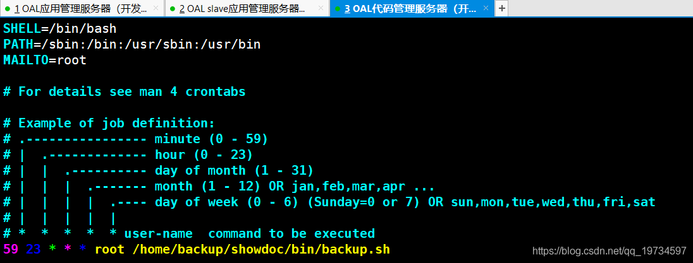
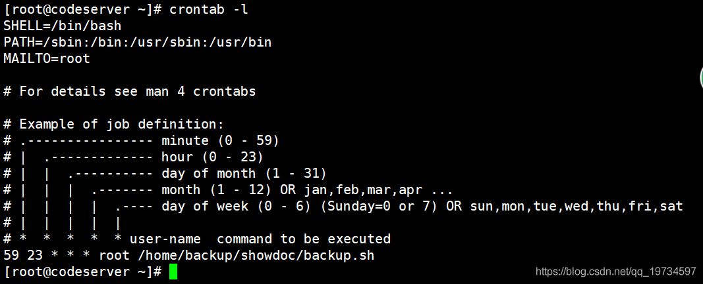

# Centos7 设置定时任务

**1、安装 crontabs服务并设置开机自启：**

```bash
yum install crontabs
systemctl enable crond
systemctl start crond
```

**2、配置定时规则**

```
 vim /etc/crontab
```

在配置文件中配置你的定时执行规则

```
59 23 * * * root /home/backup/showdoc/backup.sh
```

backup.sh是你将要定时执行的脚本文件，如图所示：



规则很简单，看注释就能看懂了，从左到右分别是 分钟（0~59）、小时（0~23）、天（1~31）、月(1~12)、星期(0~6)、用户名、要执行的命令或者脚本。

脚本内容如下：

```bash
#! /bin/bash
t=$(date +%Y%m%d%H%M%S)
cd /home/backup/showdoc/mount/
tar -zcvf ../data/data_$t.tar ./showdoc_data
find /home/backup/showdoc/data -mtime 7 -type f|xargs rm -f
```

t是当前日期，格式是年月日时分秒；tar -zcvf是将要备份的文件打成压缩包，后缀会带上日期；find ... -mtime 7 ...|xargs rm -f是只保留近七日的备份文件，之前的都会删掉。

**3、保存生效**

```
 crontab /etc/crontab
```

**4、查看任务**

```
crontab -l
```

任务列表，如图所示： 



到此定时任务配置完成。