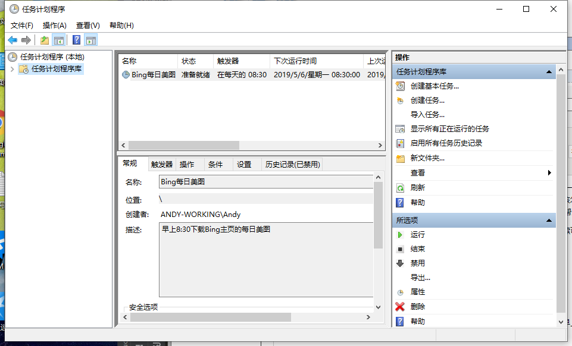
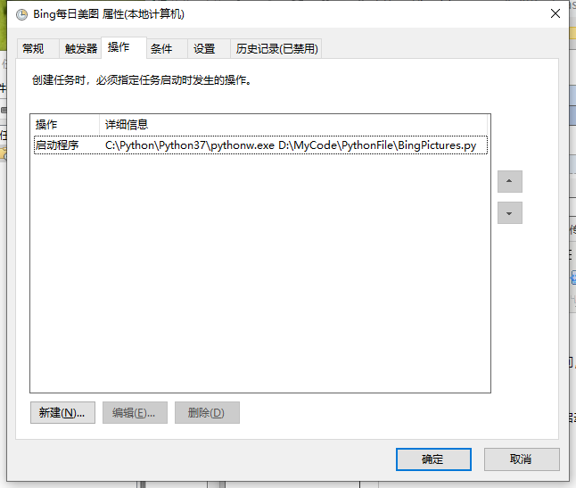
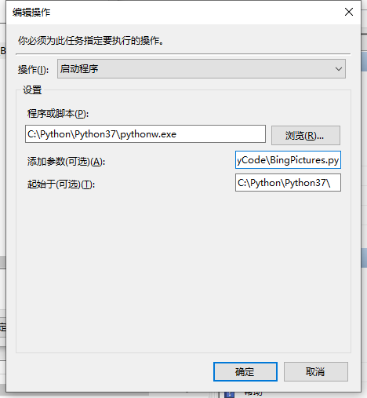

# window10 定时任务

首先，我们肯定是要用到Windows下的【计划任务】功能，如下图所示：

 

 

之后点击右侧的【创建基本任务】，输入任务名称以及可选的任务描述：

 

点击下一步，设置任务的开始时间，这个应该没什么难度，我这里设置为每天早上10点运行此计划任务：

 

点击下一步，设置【操作】为【启动程序】，再点击下一步，最关键的地方来了，这里该怎么填写才能保证系统正确地运行Python程序呢？

 

废话不多说，先看具体的设置：

 

 

 

 

 

 

这里解释一下三个文本框内容的含义，【程序或脚本】文本框中填的是Python编译器的名称，一般就是python.exe，**这里用的是pythonw.exe,这样就不会有IDE的弹窗出现，**【起始于】文本框中填的是Python编译器的目录，上图中假设你的Python编译器的完整路径是“C:\Python37\python.exe”，【添加参数】文本框中填的是你的Python程序的完整路径，这里假设在C盘的Users文件夹下面有一个叫做code.py的文件。如果你的Python程序包含命令行参数，将其添加到Python程序的完整路径之后即可。

 

**相信聪明的读者已经发现了，如果将这三部分连在一起，就是“C:\Python37\python.exe C:\Users\code.py”，这其实就是在Windows命令行下输入“python C:\Users\code.py”（或“python code.py”，如果你正好在C:\Users目录下），只是在计划任务的设置中需要给出完整的python编译器的路径而已。**