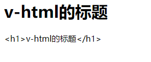
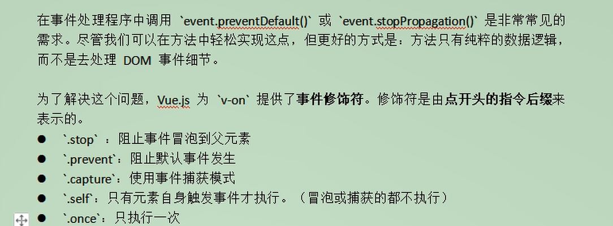
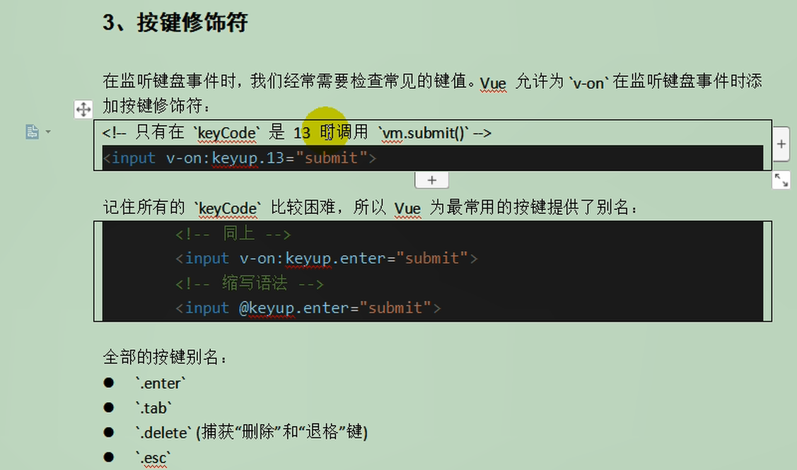
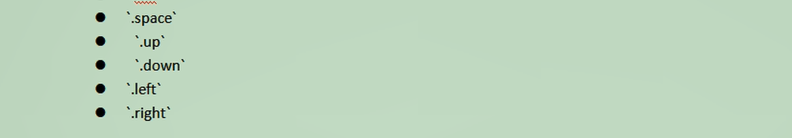
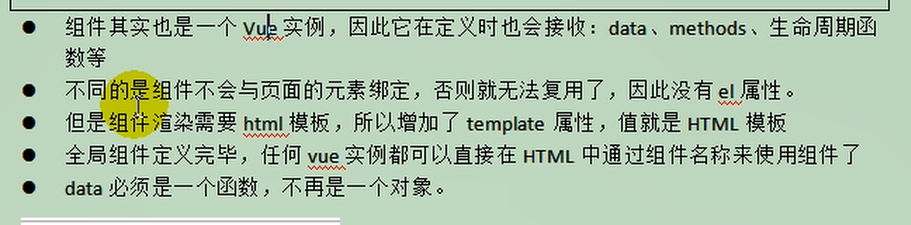

#  vue

Vue (读音 /vjuː/，类似于 **view**) 是一套用于构建用户界面的**渐进式框架**。与其它大型框架不同的是，Vue 被设计为可以自底向上逐层应用。Vue 的核心库只关注视图层，不仅易于上手，还便于与第三方库或既有项目整合。另一方面，当与[现代化的工具链](https://cn.vuejs.org/v2/guide/single-file-components.html)以及各种[支持类库](https://github.com/vuejs/awesome-vue#libraries--plugins)结合使用时，Vue 也完全能够为复杂的单页应用提供驱动。

`MVVM`思想

- `M`:`module` 包含数据和一些基本的操作
- `V`: `view`视图,页面渲染结果
- `VM`:`view-module`模型和视图间的双向操作

视图和数据通过`VM` 绑定起来,模型里面有变化会自动的通过`Directives` 填写到视图中,视图表单中添加了内容也会自动的通过`DOM Listeners` 保存到模型中

教程：https://cn.vuejs.org/v2/guide/

## 安装

- 直接下载并使用`<script>` 标签引入
- 或者直接在控制台使用`npm install vue`引入,
  - 先使用`npm init -y ` 初始化项目, 生成了一个`package.json` 文件,说明它是一个`npm` 管理的项目
  - `npm install vue`,安装后在项目`node_modules` 里就有了vue

## `vue`  声明式渲染

```javascript
let vue = new Vue({ // 生成vue 对象

				el: "#app", // 绑定元素, id=app
				data: { //封装数据

					name: "张三",
					num: 0
				},
				methods: {

					// 取消点赞的方法
					cancle() {

						this.num--;

					},
					hello() {
						return "1";

					}
				}
			});
```


## 双向绑定,模型变化, 视图变化. 反之亦然

双向绑定,使用`v-model` 指令

```html
	<input type="text" v-model="num" />
```

```javascript
<h1>{{name}}, 非常帅,有{{num}}人为他点赞{{hello()}}</h1>
```


`index.html`

```html
<!DOCTYPE html>
<html>
	<head>
		<meta charset="utf-8">
		<title></title>
	</head>

	<body>
		<div id="app">

			<input type="text" v-model="num" />
			<button v-on:click="num++">点赞</button>
			<button v-on:click="cancle()">取消</button>
			<h1>{{name}}, 非常帅,有{{num}}人为他点赞{{hello()}}</h1>

		</div>

		<script src="./node_modules/vue/dist/vue.js"></script>
		<script>
			let vue = new Vue({ // 生成vue 对象

				el: "#app", // 绑定元素, id=app
				data: { //封装数据

					name: "张三",
					num: 0
				},
				methods: {

					// 取消点赞的方法
					cancle() {

						this.num--;

					},
					hello() {
						return "1";

					}
				}
			});
		</script>
	</body>


</html>

```

##  事件处理

`v-xx` 指令,比如`v-on:click` 是按钮的单击事件

在`vue` 中, `el`,`data`,`methods`的作用

- `el`:  用来绑定数据
- `data`: 用来封装数据
- `methods`: 用来封装方法,并且能够封装多个方法,如上面封装了`calcle` 方法和`hello`  方法


##  `v-text`和`v-html`指令

`v-text`指令会将绑定的内容按照文本进行展示,会对`html` 标签进行转义. 

`v-html` 指令会将绑定的内容按照`html`元素进行展示,不会对`html` 标签进行转义,而是直接在浏览器上显示`data`所设置的内容

```html
<!DOCTYPE html>
<html>
	<head>
		<meta charset="utf-8">
		<title>演示vue的v-text和v-html指令的demo</title>
	</head>
	<body>
		<div id="app">

			<span v-html="html"></span>
			<span v-text="text"></span>
			</div<>
	</body>
	<script src="./node_modules/vue/dist/vue.js"></script>
	<script>
		let vue = new Vue({
			el: "#app",
			data: {

				html: "<h1>v-html的标题</h1>",
				text: "<h1>v-html的标题</h1>"
			},

			methods: {

			}
		});
	</script>
</html>

```

显示的内容为: 




## `v-bind`  单向绑定

`v-bind` 指令用于动态的绑定一个或者多个`attribute` 中,

```html
<!DOCTYPE html>
<html>
	<head>
		<meta charset="utf-8">
		<title>使用v-bind进行演示</title>
	</head>
	<body>
		<div id="app">

			<a v-bind:href="link">百度一下</a>
			<span v-bind:class="{active:isActive,'text-danger':hasError}" :style="{color:color1,fontSize:size}">大家好, 才是真的好</span>
			</div<>
	</body>
	<script src="./node_modules/vue/dist/vue.js"></script>
	<script>
		let vue = new Vue({
			el: "#app",
			data: {
				link: "https://baidu.com",
				isActive: true,
				hasError: true,
				color1: 'red',
				size: "100px"

			},

			methods: {


			}
		});
	</script>
</html>

```

上面所完成的任务就是给一个`a` 标签绑定一个超链接, 当`isActive` 和`hasError` 都是`true`的时候,将属性动态的绑定 `active`和`text-danger` `class`,这样可以动态的调整属性的存在. 

而且如果实时的修改`vm`的`size`和`color1`, `span`元素的`style` 样式也会随着改变, 则可以写作`v-bind:style`, 也可以省略为`:style`


## `v-model` 双向绑定

```html
<!DOCTYPE html>
<html>
	<head>
		<meta charset="utf-8">
		<title>vue双向绑定</title>
	</head>
	<body>
		<div id="app">
			<input type="checkbox" v-model="language" value="java" />java<br>
			<input type="checkbox" v-model="language" value="python" />python<br>
			<input type="checkbox" v-model="language" value="go" />go<br>

			选中了{{language.join(",s")}}
			</div<>
	</body>
	<script src="./node_modules/vue/dist/vue.js"></script>
	<script>
		let vue = new Vue({
			el: "#app",
			data: {
				
				
				language: []
			},

			methods: {

			}
		});
	</script>
</html>

```

上面的功能主要是完成通过`v-model` 为输入框绑定多个值,能够实现选中的值,在`data`的`language` 也在不断的发生着变化

通过`v-model` 实现了页面发生了变化，则数据发生变化，数据发现变化,页面也发生变化,这样就实现了双向绑定的功能. 


## `v-on` 为按钮绑定事件

```html
<button v-on:click="num++">点赞</button>
<button v-on:click="cancle()">取消</button>
```

上面是为两个按钮绑定了单击事件,其中一个对于`num` 自增， 一个对`num` 自减

`v-on:click` 也可以写作`@click`


事件的冒泡

```html
	<div style="border: 1px solid red; padding: 20px;" @click="hello">

				大的div
				<div style="border: 1px solid blue; padding: 20px;" @click="hello">
					小的div
					<<a href="http://baidu.com" @click="hello">百度一下你就知道了</a>

				</div>

			</div>
```

上面的这两个嵌套`div` 中， 如果点击了内层的`div`, 则外层的`div` 也会被触发,这种问题可以用事件修饰符来完成. 

 ```html

			<div style="border: 1px solid red; padding: 20px;" @click="hello">

				大的div
				<div style="border: 1px solid blue; padding: 20px;" @click="hello">
					小的div
					<<a href="http://baidu.com" @click.prevent.stop="hello">百度一下你就知道了</a>
					<!--这里禁止了超链接的点击跳转事件,并且只会触发当前对象的操作 -->

				</div>

			</div>
 ```

关于事件修饰符




按键修饰符







## `v-for` 遍历循环

```html
<!DOCTYPE html>
<html>
	<head>
		<meta charset="utf-8">
		<title>vue的v-for演示</title>
	</head>
	<body>
		<div id="app">

			<li v-for="(user,index) in users" :key="user.name" v-if="user.gender == '女'">

				<!-- 1. 显示user信息:v-for="item in items" -->
				当前索引:{{index}} ==>{{user.name}}==>{{user.gender}} =>{{user.age}}
				<!-- 2. 获取数组的下标: v-for="(item,index) in users"-->
				<!-- 3. 遍历对象：
				   v-for="value in object"
				   v-for = "(value,key) in object"
				   v-for = "(value,key,index) in object"
				
				-->
				<br>
				对象信息
				<br>
				<span v-for="(v,k,i) in user">
					{{k}} ==>{{v}} =>{{i}} <br>
				</span>
			</li>


			<!-- 4. 遍历的时候,加上:key 来区分不同的数据,提高vue 的渲染效率-->
			<ul>
				<li v-for="(num,index) in nums" :key="index">
					{{num}}
				</li>

			</ul>
			</div<>
	</body>
	<script src="./node_modules/vue/dist/vue.js"></script>
	<script>
		let vue = new Vue({
			el: "#app",
			data: {

				users: [{
						name: "张三",
						age: 18,
						gender: '男'
					},
					{
						name: "李四",
						age: 26,
						gender: '女'
					}, {
						name: "王五",
						age: 35,
						gender: '男'
					}, {
						name: "赵六",
						age: 48,
						gender: '男'
					}

				],
				nums: [2, 3, 5, 2, 1]


			},

			methods: {

			}
		});
	</script>
</html>

```

##  过滤器

```html
<!DOCTYPE html>
<html>
	<head>
		<meta charset="utf-8">
		<title>vue 过滤器</title>
	</head>
	<body>
		<div id="app">

			<!-- 过滤器通常用来处理文本格式化的操作,过滤器可以用在两个地方: 双花括号插值和v-bind 表达式-->
			<ul>

				<li v-for="user in users">
					{{user.name}} ==> {{user.age}} ==>{{user.gender == 1 ? "男":"女"}} ==> {{user.gender | genderFilter}} ==> {{user.gender | gFilter}} 
					<!-- 这里的| 表示管道,将--user.gender的值交给genderFilter -->


				</li>


			</ul>
			</div<>
	</body>
	<script src="./node_modules/vue/dist/vue.js"></script>
	<script>
		// 全局过滤器

		Vue.filter("gFilter", function(val) {

			if (val == 1) {
				return "男..."
			} else if (val == 0) {

				return "女..."
			}
		})
		let vue = new Vue({
			el: "#app",
			data: {


				users: [{
						name: "张三",
						age: 18,
						gender: '1'
					},
					{
						name: "李四",
						age: 26,
						gender: '0'
					}, {
						name: "王五",
						age: 35,
						gender: '1'
					}, {
						name: "赵六",
						age: 48,
						gender: '1'
					}

				]
			},

			methods: {

			},
			filters: {
				// filters 定义局部过滤器,只能在当前vue实例中使用
				genderFilter(val) {
					if (val == 1) {
						return "男"
					} else if (val == 0) {

						return "女"
					}
				}
			}
		});
	</script>
</html>

```

## 组件化

```html
<!DOCTYPE html>
<html>
	<head>
		<meta charset="utf-8">
		<title>vue的组件化</title>
	</head>
	<body>
		<div id="app">


			<button @click="count++">我被点击了{{count}}次 </button><br>
			<counter></counter> <br>
			<counter></counter><br>
			<counter></counter><br>
			<counter></counter><br>
			<counter></counter><br>
			<!-- 使用所定义的组件button-counter -->
			<button-counter></button-counter><br>

			</div<>
	</body>
	<script src="./node_modules/vue/dist/vue.js"></script>
	<script>
		// 1. 全局声明注册一个组件

		Vue.component("counter", {

			template: `<button v-on:click="count++">我被点击了 {{count}} 次</button>`,
			data() {
				return {
					count: 1
				}
			}
		});


		// 2. 局部声明一个组件

		const buttonCounter = {
			template: `<button v-on:click="count++">我被点击了 {{count}} 次........</button>`,
			data() {
				return {
					count: 1
				}
			}
		}
		vue = new Vue({
			el: "#app",
			data: {
				count: 1

			},
			components: {

				// 声明所定义的局部组件
				"button-counter": buttonCounter
			},
			methods: {

			}
		});
	</script>
</html>

```





##  生命周期钩子函数

```html
<!DOCTYPE html>
<html>
	<head>
		<meta charset="utf-8">
		<title>vue的组件化</title>
	</head>
	<body>
		<div id="app">


			<button @click="count++">我被点击了{{count}}次 </button><br>
			<counter></counter> <br>
			<counter></counter><br>
			<counter></counter><br>
			<counter></counter><br>
			<counter></counter><br>
			<!-- 使用所定义的组件button-counter -->
			<button-counter></button-counter><br>

			</div<>
	</body>
	<script src="./node_modules/vue/dist/vue.js"></script>
	<script>
		// 1. 全局声明注册一个组件

		Vue.component("counter", {

			template: `<button v-on:click="count++">我被点击了 {{count}} 次</button>`,
			data() {
				return {
					count: 1
				}
			}
		});


		// 2. 局部声明一个组件

		const buttonCounter = {
			template: `<button v-on:click="count++">我被点击了 {{count}} 次........</button>`,
			data() {
				return {
					count: 1
				}
			}
		}
		vue = new Vue({
			el: "#app",
			data: {
				count: 1

			},
			components: {

				// 声明所定义的局部组件
				"button-counter": buttonCounter
			},
			methods: {

			}
		});
	</script>
</html>

```

##  生命钩子函数

```html
<!DOCTYPE html>
<html>
	<head>
		<meta charset="utf-8">
		<title>vue</title>
	</head>
	<body>
		<div id="app">

			<span id="num">
				{{num}}
			</span>
			<button @click="num++">赞</button>
			<h2>{{name}},有{{num}}人点赞</h2>
			</div<>
	</body>
	<script src="./node_modules/vue/dist/vue.js"></script>
	<script>
		let vue = new Vue({
			el: "#app",
			data: {
				num: 1,
				name: "张三"
			},

			 methods: {
			                show() {
			                    return this.name;
			                },
			                add() {
			                    this.num++;
			                }
			            },
			            beforeCreate() {
			                console.log("=========beforeCreate=============");
			                console.log("数据模型未加载：" + this.name, this.num);
			                console.log("方法未加载：" + this.show());
			                console.log("html模板未加载：" + document.getElementById("num"));
			            },
			            created: function () {
			                console.log("=========created=============");
			                console.log("数据模型已加载：" + this.name, this.num);
			                console.log("方法已加载：" + this.show());
			                console.log("html模板已加载：" + document.getElementById("num"));
			                console.log("html模板未渲染：" + document.getElementById("num").innerText);
			            },
			            beforeMount() {
			                console.log("=========beforeMount=============");
			                console.log("html模板未渲染：" + document.getElementById("num").innerText);
			            },
			            mounted() {
			                console.log("=========mounted=============");
			                console.log("html模板已渲染：" + document.getElementById("num").innerText);
			            },
			            beforeUpdate() {
			                console.log("=========beforeUpdate=============");
			                console.log("数据模型已更新：" + this.num);
			                console.log("html模板未更新：" + document.getElementById("num").innerText);
			            },
			            updated() {
			                console.log("=========updated=============");
			                console.log("数据模型已更新：" + this.num);
			                console.log("html模板已更新：" + document.getElementById("num").innerText);
			            }
			        });
	</script>
</html>

```

