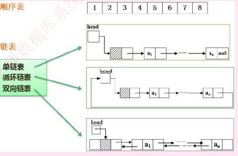
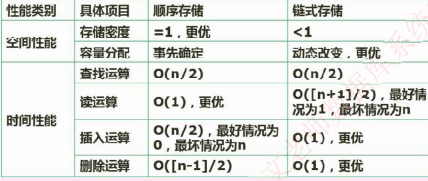
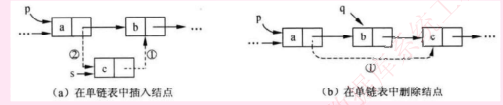
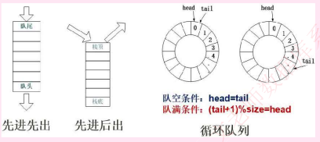
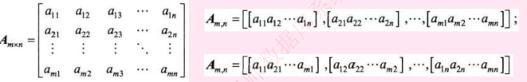
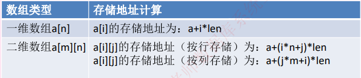
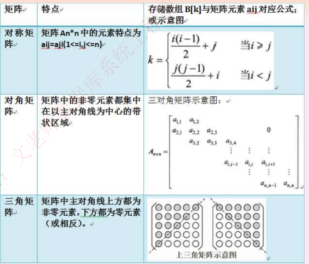

# 数据结构与算法

## 1. 线性结构

线性结构: 每个元素最多只有一个出度和一个入度,表现为一条线状.线性表按存储方式分为顺序表和链表. 

### 顺序存储

用一组地址连续的存储单元依次存储线性表中的数据元素,使得逻辑上相邻的元素在物理上也相邻. 

### 链式存储

存储各数据元素的节点的地址并不要求是连续的,数据元素逻辑上相邻,物理上分开. 



顺序存储和链表存储的对比



- 在空间上,因为链表还需要存储指针,因此有空间浪费的存在.
- 在时间方面, 由顺序表和链表的粗出方式可知,当需要对元素进行破坏性操作(插入/删除)时,链表效率更高,因此其只需要修改指针指向即可. 而顺序表因为地址是连续的, 当删除或插入一个元素后, 后面的其他节点位置都需要变动.
- 而当需要对元素不改变结构操作时(读取、查找),顺序表效率更高,因为其物理地址是连续的,如同数组一般,只需按索引号就可以快速定位, 而链表需要从头节点开始, 一个一个的查找下去.

### 1.1 单链表

单链表的插入和删除



再上图中p所指向的节点后插入s所指定的节点,操作为:

```text
s->next=p>next
p->next=s
```

同理,在单链表中删除p所指向的节点的后继节点q时, 操作为:

```
p->next=p>next->next
free(p);
```

### 1.2 栈和队列

队列和栈也是线性结构,结构如下图: 队列是先进先出,分对头和队尾. 栈是先进后出, 只有栈顶才能进出. 



循环队列中,头指针指向第一个元素,尾指针指向最后一个元素的下一个位置,因此, 当队列空的时候,`head=tail`, 当队列满的时候 ，`head=tail`, 这样就无法区分了,因此,一般将队列少存一个元素,这样,队列满的条件就是`head+1=tail`,而考虑到是循环队列,必须要处于最大元素数来取余数,即`(tail+1)%size=head`,如上图所示的两个公式 循环队列的长度公示为`(Q.tail-Q.head)%size`. 

优先队列:元素被赋予优先级,当访问元素时, 具有最高优先级的元素最先被删除,使用堆来存储,因为其不是按照元素进队列的顺序来决定的. 

### 1.3 串

字符串是一种特殊的线性表,其数据结构都是字符串

空串: 长度为0的字符串,没有任何字符

空格串: 由一个或者多个空格组成的串,空格是空白字符, 占一个字符长度. 

字串: 串中任意长度的连续字符构成的序列称为字串.含有字串的串为主串. 

串的模式匹配算法: 字串的定位操作,用于查找字串在主串中第一次出现的位置的算法. 

基本的模式匹配算法:也称为布鲁特-福斯算法,其基本思想是从主串的第1各字符其与模式串的第一个字符进行比较,若相等,则继续逐个字符进行后续的比较. 否则从主串的第2个字符起与模式串的第1个字符重新比较,直至模式串中的每一个字符依次和主串中的一个连续的字符串列相等为止. 此时称为匹配成功, 否则称为匹配失败. 

KMP算法: 对基本模式匹配算法的改进,其改进之处在于:每当匹配过程中出现相比较的字符串不相等时,不需要回溯主串的字符位置指针,而是利用已经得到的"部分匹配" 结果将模式串 向右 滑动尽可能远的距离,再继续进行比较. 

### 1.4  数组

数组是定长线性表再维度上的扩展, 即线性表中的元素又是一个线性表. N维数组是一种同构的数据结构,其每个数据元素类型相同,结构一致. 

一个m行n列的数组表示如下:



其可以表示为行向量形式或者列向量形式线性表,单个关系最多只有一个前驱和一个后继,本质上还是线性. 

数组结构的特点: 数据元素数据固定,数组元素类型相同. 数组元素的下标关系具有上下界的约束且下标有序. 

数组数据元素固定,一般不做插入和删除运算,适合于采用顺序结构. 

数组存储地址的计算,特别是二维数组,要注意理解: 假设每个数组元素占用存储场地为len ,起始地址为a,存储地址计算如下:



### 1.5 矩阵

#### 1.5.1 特殊矩阵

矩阵中的元素(或非0元素) 的分布有一定的规律. 常见的特殊矩阵有对称矩阵、三角矩阵、对角矩阵. 



####  1.5.2 稀疏矩阵

在一个矩阵中,若非零元素的个数远远少于零元素的个数,且非零元素的分布没有规律.

存储方式为三元组结构,即存储每个非零元素的(行、列、值)


###  1.6  广义表

广义表是线性表的推广,是由0个或者多个单元素或者子表组成的有限序列. 

广义表与线性表的区别: 线性表的元素都是结构上不可分的单元素,而广义表的元素既可以单元素,也可以是有结构的表.

广义表一般记为: `LS=(a1,a2,.....an)`

其中,LS是表名,ai是表元素,它可以是表(称为子表),也可以是数据元素(称为原子).其中n 是广义表的长度(也就是最外层包含的元素个数),n=0的广义表为空表,而递归定义的重数就是广义表的深度, 即定义中所含括号的重数(单边括号的个数,原子的深度为0, 空表的深度为1)

`head()和tail()`, 取表头(广义表的第一个表元素,可以是子表也可以是单元素)和取表位(广义表中, 除了第一个表元素之外的其他所有表元素组成的表,非空广义表的表尾必定是一个表,即使表尾是单元素)操作. 

