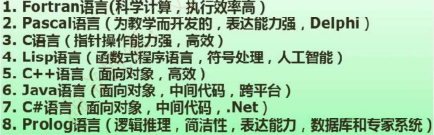
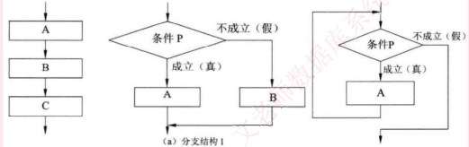
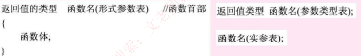
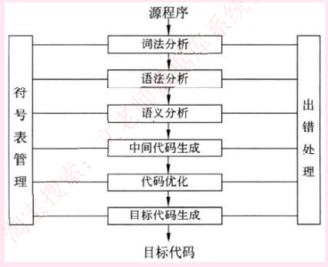
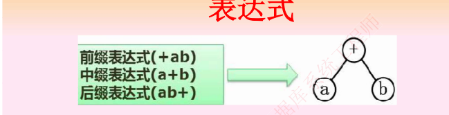

# 程序设计语言基础知识

## 1. 程序设计语言概述

程序设计语言是为了书写计算机程序而人为设计的符号语言,用于对计算过程进行描述,组织和推导.

低级语言: 机器语言(计算机硬件只能识别0和1的指令序列),汇编语言

高级语言: 功能更强，抽象级别更高,与人们使用的自然语言比较接近.

各程序设计语言特点:

解释和编译:都是将高级语言翻译成计算机硬件认可的机器语言加以执行.

不同之处在于编译程序生成独立的可执行文件,直接运行,运行时无法控制源程序,效率高. 

而解释程序不生成可执行文件,可以逐条解释运行,用于调式模式,可以控制源程序,因为还需要控制程序,因此执行速度慢,效率低. 

程序设计语言组成:

- 语法: 一组规则
- 语义: 语法成分的含义
- 语用: 构成语言的各个记号和使用者的关系

## 2. 程序设计语言的基本成分

数据成分: 指一种程序设计语言的数据和数据类型

数据分为常量(程序运行时不可改变)、变量(程序运行时可以改变)、全局量(存储空间在静态数据区分配)、局部量(存储空间在堆栈区分配)

数据类型有整形、字符型、双精度、单精度浮点型、布尔型.

运算成分: 指明允许使用的运算符号以及运算规则

包括: 算法运算、逻辑运算、关系运算、位运算等.

控制成分: 指明语言允许表述的控制结构.

包括顺序结构、选择结构、循环结构(初始化+循环体+循环条件)

传输成分: 指明语言允许的数据传输方式.如赋值处理、数据的输入输出等. 

函数: C程序由一个或者多个函数组成,每个函数都一个名字,其中有且仅有一个名字为`main` 的函数作为程序运行时的起点. 

函数是程序模块的主要成分,是一段具有独立功能的程序. 

函数使用涉及三个概念, 函数定义、函数声明(先声明后使用)、函数调用. 

传值调用: 将实参的值传递给形参,形参的改变不会导致调用点所传的实参的值的改变. 

实参可以是合法的变量、常量、表达式. 

传址调用: 即引用调用,将实参的地址传递给形参, 相当于实参存储单元的地址引用,因此其值改变的同时就改变了实参的值. 

实参不能是常量,只能是合法的变量和表达式. 

因此, 在编程中,要改变参数值,就传址, 不改变,就传值.

## 3. 编译程序的基本原理

编译程序的功能是把某高级语言书写的源程序翻译成与之等价的目标程序(汇编语言或者机器语言), 编译程序工作过程分为6个阶段, 如下图所示:

### 语法分析: 

语法分析: 是编译过程的第一个阶段

这个阶段的任务是从左到右一个字符一个字符的读入源程序,即对构成源程序的字符串进行扫描然后根据构词规则识别单词(也称单词符号或符号)

### 语法分析: 

是编译过程的一个逻辑阶段

语法分析的任务是在词法分析的基础上将单词序列组合成各类语法短语,如“程序”、“语句”,‘“表达式’等等，语法分析程序判断源程序在结构上是否正确.

### 语义分析

是编译过程的一个逻辑阶段

语法分析的任务是对结构上正确的源程序进行上下文有关性质的审查,进行类型审查. 如类型匹配, 除法除数不为0等. 

又分为静态语义错误(在编译阶段能查出来)和动态语义错误(只能在运行时发现)

中间代码和目标代码生成: 中间代码是根据语义分析产生的,需要经过优化连接，最终生成可执行的目标代码. 

引入中间代码的目的是进行与机器无法的代码优化处理. 

常用的中间代码有后缀式(逆波兰式)、三元式(三地址码)、四元式和树等形式. 

需要考虑三个问题:

- 一是如何生成较短的目标代码
- 二是如何充分利用计算机中的寄存器,减少目标代码访问存储单元的次数
- 三是如何充分利用计算机指令系统的特点,以提高目标代码的质量

### 表达式

主要掌握上述三种表达式即可,其实就是树的三种遍历,一般正常的表达式是中序遍历.即中缀遍历,根据其构造出树,再按照题目要求求出前缀或者后缀

简单求法: 后缀表达式是从左到右开始,先把表达式加上括号,再依次把运算符加到本层次的括号后面. 

