#   计算机系统基础

##  1. 计算机硬件组成

> 计算机的硬件基本系统由五大部分组成: 运算器、控制器、存储器、输入设备(如键盘鼠标)、输出设备(如显示器)

存储器分为

- 内部存储器(即内存, 容量小,速度快,临时存放数据)

- 外部存储器(即硬盘、光盘等,容量大,速度慢,长期保存数据)

输入设备和输出设备合并称为外部设备,即外设

主机: CPU+主存储器

## 2. 中央处理单元CPU

中央处理单元组成: 运算器、控制器、寄存器和内部总线组成. 

中央处理单元功能: 实现程序控制、操作控制、时间控制、数据控制功能 

### 2.1 运算器

####  2.1.1 运算器组成:

- 算数逻辑单元ALU(实现对数据的算法和逻辑运算)
- 累计寄存器AC(运算结果和源操作数的存放区)
- 数据缓冲寄存器DR(暂时存放内存的指令和数据)
- 状态条件寄存器PSW(保存指令运行结果的条件码内容,如溢出标识等)

#### 2.1.2 运算器功能:

​    执行所有的算数运算,如加减乘除等；执行所有的逻辑运算并进行逻辑测试, 如与、或、非、比较等. 

###  2.2 控制器

####  2.2.1 控制器组成

- 指令寄存器IR(暂存CPU执行的指令)
- 程序计数器PC(存放指令的执行地址)
- 地址寄存器AR(保存当前CPU所访问的内存地址)
- 指令译码器ID(分析指令操作码)

#### 2.2.2 控制器功能

 控制整个CPU的工作,最为重要,包括程序控制,时序控制等. 

## 3. 数据的进制转换

进制的表示: 二进制、十六进制,一般二进制的符号为`0B`, 表示为`0B0011`, 十六进制的符号为`Ox` 或者`H`, 也可以表示为`0x18F` 或者`18FH`

####  R 进制整数转十进制:

 位权展开法: 用`R` 进制数的每一位乘以R的n次方,n是变量，从R进制数的整数最低位开始,依次为0,1,2,3,3333累加.

> 例如: 有6进制数5043, 此时R =6,用六进制数的每一位乘以6的n次方,n是变量，从6进制的整数最低位开始(5043 从低位到高位的排列: 3,4,0,5),n 依次为0,1,2,3,那么最终`5043=3*6^0+4*6^1+0*6^3+5*6^4=1107`

#### 十进制转R进制

  十进制整数（除以R倒取余数）, 用十进制整数除以R, 记录每次所得余数,若商不为0,则继续除以R,直至商为0, 而后将所有余数从下至上记录,排列成从左至右的顺序,即为转换后的R 进制. 

> 例如: 有十进制数200,转换为6进制,此时R =6, 将200/6=33, 余数为2, 因为商不为0，因此将33/6,得商=5,余数为3, 再将5/6, 得商为0, 余数为5. 将所有余数从下到上排列为 532. 

#### m进制转n进制

​    先将m进制转换为10进制,再将10进制转换为n进制,中间需要通过十进制中转, 但是下面两种进制可以直接转换

#### 二进制转八进制

  每三位二进制数转换为一位八进制数,二进制个数不是三的倍数,则在前面补零(原则是数值不变), 如二进制数01101 有五位,前面补零的话为 001101, 每三位转换为一个八进制, `001 = 1*2^0+0*2^1+0*2^2=1`, `101 =1*2^0+0*2^1+1*2^2=5`,也就是结果等于15

#### 二进制转十六进制

每四位二进制转换为一位十六进制数, 二进制位数不是4的倍数则在前面补零, 如二进制101101 有六位数,则在前面补零为00101101,   每四位转换为一个十六进制,`0010=0*2^0+1*2^1+0*2^2+0*2^3=2`, `1101=1*2^0+0*2^1+1*2^2+1*2^3=13`，13在十六进制中表示为D，则最后结果为2D

## 4. 数的表示

机器数: 各种数值在计算机中表示的形式,其特点是使用二进制计数制,数的符号用0和1表示,小数点则隐含,不占位置. 

机器数有无符号位和带符号位之分,无符号数表示正数,没有符号位. 带符号数最高位为符号位, 正数符号位为0, 负数符号位为1. 

定点表示法为纯小数和纯整数两种,其中小数点不占存储位, 而是按照以下约定:

- 纯小数: 约定小数点的位置在机器数的最高数值位之前
- 纯整数: 约定小数点的位置在机器数的最低数值位之后

真值: 机器数对应的实际数值

## 5. 数的编码方式

带符号位有下列编码方式:

- 原码: 一个数的正常二进制表示,最高位表示符号, 数值0的原码有两种形式: `+0 `(0 00000000) 和`-0(1 00000000)`
- 反码: 正数的反码即原码. 负数的反码是在原码的基础上,除符号位外,其他各位按位取反. 数值0的反码也有两种形式,`+0(0 00000000)`和`-0(1 11111111)`
- 补码:  正数的补码就是原码,负数的补码是在原码的基础上,除符号位外,其他各位按位取反,而后末尾+1,若有进位则产生进位,因此数值0的补码只有一种形式: `+0 = -1=0 00000000`
- 移码：用做浮点运算的阶码,无论正数负数,都是将该原码的补码的首位(符号位) 取反得到移码

机器字长为n时各种码制表示的带符号位的取值范围(差别在于0的表示: 原码和反码分别为`+0`和`-0`, 补码只有一个`-0`, 因此可以多表示一个)

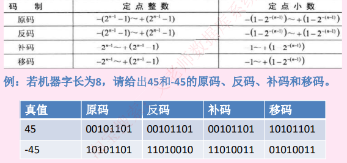

## 6. 浮点数的表示

浮点数: 表示方法为`N=F*2^E`, 其中E 成为阶码,F成为尾数; 类似于十进制的科学计数法, 如`85.125=0.52125*10^2`,二进制如`101.011=0.101011*2^3`

在浮点数的表示中,阶码为带符号的纯整数,尾数为带符号位的纯小数,要注意符号占最高位(正数0 负数1), 其表示格式如下:

| 阶符 | 阶码 | 数符 | 尾数 |
| ---- | ---- | ---- | ---- |
|      |      |      |      |

很明显,与科学计数法类似,一个浮点数的表示方法不是唯一的,浮点数所能表示的数值范围由阶码确定,所表示的数值精确度由尾数确定. 

尾数的表示采用规格化方法,也即带符号位数的补码必须是`1.0xxxx`（负数）, 或者`0.1xxxx`(负数), 其中x可以为0或者1

浮点数的运算: 

- 对阶:使两个数的阶码相同,小阶向大阶看齐,较小阶码增加几位,尾数就右移几位
- 尾数计算(相加, 若是减运算, 则加负数)
- 结果规格化(即尾数表示格式化,带符号尾数转换为 `1.0xxxxx` 或者`0.1xxxx`)

## 7. 算数运算和逻辑运算

数与数之间的算数运算包括 加、减、乘、除等基本算数运算,对于二进制,还需要掌握基本逻辑运算, 包括:

- 逻辑与`&` : 0和1相与，只要有一个为0结果则为0,两个都为1才为1
- 逻辑或`|`: 0和1相或,只要有一个为1则结果为1, 两个都为0则为0
- 异或:同0非1, 即参加运算的二进制同为0或者同为1 则结果为0, 一个为0 另外一个结果为1 则为1
- 逻辑非！: 0的非是1,1的非是0
- 逻辑左移`<<`: 二进制整体左移n位. 高位溢出则舍去, 低位补0
- 逻辑右移`>>`: 二进制整体右移n位,低位溢出则舍去,高位补0

## 8. 校验码

码距: 就单个编码A: 00而言,其码距为1, 因为只需要改变一位就变成了另外一个编码. 在两个编码中,从A编码到B编码的转换所需要改变的位数称为码距. 如A： 00 要转换为B:11, 码距为2 . 一般来说,码距越大,越利于纠错和检错. 

### 8.1 奇偶校验码

奇偶校验码: 在编码中增加1位校验位来使编码中1的个数为奇数(奇校验码) 或者偶数(偶校验码),从而使得码距为2. 例如: 

- 奇校验码: 在编码中,含有奇书个1,发送给接收方,接收方收到之后,会计算收到的编码有多少个1,如果是奇数个1,则无误. 如果是偶数个,则有误. 
- 偶校验码同理: 只是编码中有偶数个1, 由上述奇偶校验码只能检1位错,并且无法纠错。 

### 8.2 循环冗余校验码CRC

CRC 只能检错,不能纠错,其原理是找出来一个能整除多项式的编码,因为首先要将原始报文除以多项式,将所得的余数作为校验位加在原始报文之后,作为发送数据发给接收方,其编码格式如下: 

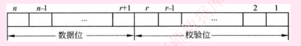

由此可知,CRC由两部分组成, 左边位信息码(原始数据), 右边为校验码,校验码是由信息码产生的,校验码位数越长,校验能力越强. 求CRC编码时,采用的是模2运算(按位运算,不发生错位和进位). 

例: 原始报文为： `11011010101`,其生成多项式为`x^4+x^3+x+1`, 对其进行CRC编码后的结果为:

 解答: 首先根据多项式得到除数11011,在原始多项式后面加上多项式最高指数个数个0, 即4个0, 和除数进行模2除法, 一直上1, 最终得出四位的余数为0011, 最终编码为`11001010101 0011`,然后发送出去,

接收方将收到的数据`11001010101 0011` 与多项式的11011 进行模2运算,若余数为0,说明校验正确,数据传输正确. 

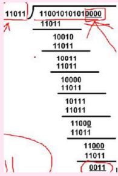

### 8.3 海明校验码

海明码, 本质也是利用奇偶性来检错和纠错的检验方式,构成方法是在数据位之间的确定位置上插入k个校验位, 通过扩大码距来实现检错和纠错. 

设数据位是n位,校验位是k位,则n和k必须满足以下关系: `2^k-1>=n+k`

> 例如：求信息1011的海明码

##### 校验位的位数和具体的数据位的位数之间的关系:

所有位都编码,从最低位编号,从1开始递增,校验位处于2的n(n=0 1 2 )次方中，即处于第1,2,4,8,16,32....位上,其余位才能填充真正的数据位,若信息数据位1011, 则可知, 第1，2，4位位校验位,第3,5,6,7位为数据位,从低位开始存放1011

 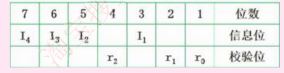

>

##### 每一位校验码的计算公式:

 需要确定每一位校验码到底校验哪些信息位,将信息位(即编号) 拆分成二进制表示,如`7=4+2+1`, 由第4位校验码(r2) 和第2位校验码(r1) 和第1位校验码(r0) 共同校验,同理,第6位数据位6=4+2, 第5位数据位5=4+1, 第3位数据位3=2+1, 前面知道,这些2的n次方都是校验位. 可知,第4位校验位校验第7,6,5三位数据位. 因此,第4位校验位r2等于这三位数据位的值异或, 第2位和第1位校验位计算原理同上,计算出三个校验位后,可知最终要发送的海明校验码位1010101

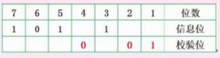

##### 检错和纠错原理

  接收方收到海明码后,会将每一位校验位与其校验的位数分别异或,即做如下三组运算:

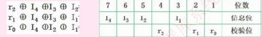

如果是偶校验,那么运算得到的结果应该全部是0, 如果是奇校验,那么应该全部位1, 才是正确, 假设是偶校验,且接受到的数据位1011101(第四位出错),此时,运算的结果位:

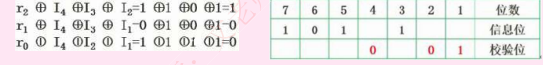

这里不全位0,表示传输过程中有误,并且按照r2r1r0排列位二进制100, 这里指出的就是错误的位数, 表示第100,即第4位出错,纠错方法就是将该位逆转.

## 9 计算机体系结构分类

`Flynn`  分类法: 如下图所示:

| 体系结构类型         | 结构                                              | 关键特性                             | 代表                                           |
| -------------------- | ------------------------------------------------- | ------------------------------------ | ---------------------------------------------- |
| 单指令单数据流`SIDI` | 控制部分:一个 处理器:一个 主存模块:一个 |                                      | 单处理系统                                     |
| 单指令多数据流       | 控制部分:一个 处理器:多个 主存模块:多个 | 各处理器以异步的形式执行同一条指令   | 并行处理机 阵列处理机 超级向量处理机 |
| 多指令单数据流       | 控制部分:多个 处理器:一个 主存模块:多个 | 被证明不可能,至少是不实际            | 目前没有,有文献称流水线计算机为此类            |
| 多指令多数据流       | 主控部分:多个 处理器:多个 主存模块:多个 | 能够实现作业,任务,指令等各级并行执行 | 多处理机系统 多计算机                     |

## 10 计算机指令

计算机指令的组成: 一条指令由操作码和操作数两部分组成,操作码决定要完成的操作, 操作数指参与计算的数据及其所在的单元地址.

在计算机中,操作要求和操作数地址都由二进制数码表示,分别称为操作码和地址码,整条指令以二进制编码的形式存放在存储器中. 

计算机指令执行过程: 取指令->分析指令-> 执行指令三个步骤,首先将程序计数器PC中的指令地址取出,送入地址总线,CPU依据指令地址去内存中取出指令内容存入指令寄存器IR, 而后由指令译码器进行分析,分析指令操作码,最后执行指令,取出指令执行所需要的源操作数. 

## 11 指令寻址方式

### 11.1 指令寻址方式:

#### 顺序寻址方式:

当执行一段程序时,是一条指令接着一条指令的顺序执行. 

#### 跳跃寻址方式:

指下一条指令的地址码不是由程序计数器给出,而是由本条指令直接给出。 程序跳跃后,按新的指令地址开始顺序执行. 因此, 程序计数器的内容也必须相应改变,以便及时跟踪新的指令地址.

### 11.2 指令操作数的寻址方式

#### 立即寻址方式

新的地址码字段指出的不是地址,而是操作数本身

#### 直接寻址方式:

在指令的地址字段中直接指出操作数在主存中的地址

#### 间接寻址方式

指令地址码字段所指向的存储单元中存储的是操作数的地址

#### 寄存器寻址方式

指令那种的地址码是寄存器的编号

## 12 指令系统

`CISC` 是复杂指令系统,兼容性强,指令繁多.长度可变,由微程序实现。

`RISC` 是精简指令系统,指令少,使用频率接近,主要依靠硬件实现(通用寄存器,硬布线逻辑控制)

主要区别如下:

| 指令系统类型   | 指令                                                         | 寻址方式   | 实现方式                                            | 其他                      |
| -------------- | ------------------------------------------------------------ | ---------- | --------------------------------------------------- | ------------------------- |
| `CISC`（复杂） | 数量多,使用频率差别大, 可变长格式                            | 支持多种   | 微程序控制技术(微码)                                | 研制周期长                |
| `RISC`(精简)   | 数量少,使用频率接近,定长格式,大部分为单周期指令,操作寄存器,只有`Load/Store` 操作内存 | 支持方式少 | 增加了通用寄存器,硬布线逻辑控制为主, 适合采用流水线 | 优化编译,有效支持高级语言 |

## 13 指令流水线

指令流水线原理: 将指令分为不同段,每段由不同的部分去处理,因此可以产生叠加的效果, 所有的部件去处理指令的不同段,如下图所示：

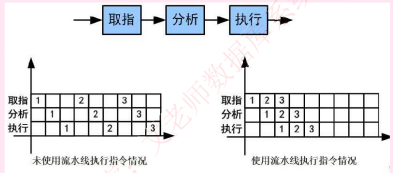

## 14 流水线相关计算

流水线周期: 指令分为不同执行段,其中执行时间最长的段位流水线周期

流水线执行时间: 1条指令的总执行时间+(总指令条数+1) *流水线周期

流水线吞吐量: 总指令条数/流水线执行时间

流水线加速比: 不使用流水线总执行时间/使用流水线总执行时间

超标量流水线技术: 常规流水线的度为1,即每条流水线阶段只执行一个部分,当度大于1时,就是超标量技术,当度为3的时候,相当于3条流水线并行执行,即取、分析、执行每段都同时执行3段指令,因此,当题目中出现度的概念时,计算时需要将: 指令条数=执行条数/度.然后再套流水线执行时间的公式.

## 15 存储系统

计算机存储系统的层次结构,如图所示:

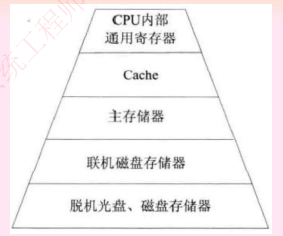

计算机采用分级存储体系的主要目的是为了解决存储容量、成本和速度之间的矛盾. 

两级存储: `Cache`主存、主存-辅存(虚拟存储体系)

局部性原理: 总的来说,在CPU 运行时,所访问的数据会趋向于一个较小的局部空间地址,包括以下两个方面:

- 时间局部性原理: 如果一个数据项正在被访问,那么在近期他很可能会再次被访问. 即在相邻的时间里会访问同一个数据项
- 空间局部性原理: 在最近的将来会用到的数据的地址和现在正在访问的的数据地址很可能是相近的,即相邻的空间地址会被连续访问

## 16 高速缓存`Cache`

高速缓存`Cache` 用来存储当前最活跃的程序和数据,直接与CPU交互,位于CPU和主存之间,容量小, 速度为内存的5-10倍, 由半导体材料构成. 其内容是主存内容的副本拷贝,对于程序员来说是透明的. 

`Cache` 由控制部分和存储器组成,存储器存储数据,控制部分判断CPU要访问的数据是否在`Cache`中,在则命中,不在则依据一定的算法从主存中替换. 

地址映射: 在CPU工作时,送出的是主存单元的地址,而应从`Cache` 存储器中读/写信息. 这就需要将主存地址转换为`Cache` 存储器地址,这种地址的转换称为地址映像,由硬件自动完成映射, 分为下列三个方法: 

#### 直接映射

将`Cache` 存储器等分为块,主存也等分为块并且编号,主存中的块与`Cache` 中的块的对应关系是固定的. 也即二者块号相同才算命中,地址变换简单但是不灵活,容易造成资源浪费. 

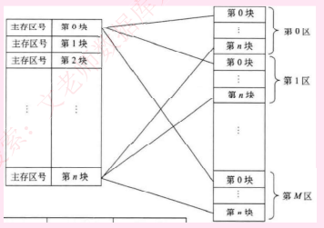

#### 全相联映像

同样都等分为块并编号,主存中任意一块都与`Cache` 中的任意一块对应, 因此可以随意插入`Cache` 中任意位置,但是地址变换复杂,速度较慢. 因为主存可以随意插入`Cache` 任意块,只有当`Cache` 满了才会发生块冲突,是最不容易发生块冲突的映像方式. 

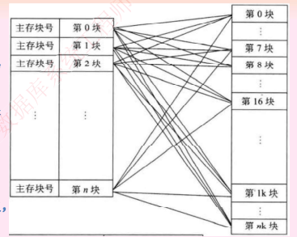

#### 组组相联映像

前面两种方式的结合,将`Cache` 存储器先分块再分组,主存也同样先分块再分组,组间采用直接映像,即主存中组好与`Cache` 中组号相同的组才能命中,但是组内全相联映像,也即组号相同的两个组内的所有块可以任意调换 . 

## 17  总线接口

从广义上来讲,任意连接两个以上电子元器件的导线都可以称为总线,通常分为以下三类:

#### 1. 内部总线:

 内部芯片级别的总线, 芯片与处理器之间通信的总线

#### 2. 系统总线

是扳级总线,用于计算机内各部分之间的连接,具体分为

- 数据总线(并行数据传输位数)、
- 地址总线(系统可管理的内存空间的大小)、
- 控制总线(传达控制命令)

代表的有`ISA`总线、`EISA` 总线、`PCI`总线

#### 3. 外部总线

设备一级的总线, 微机和外部设备的总线,代表有`RS232`(串行总线)、`SCCI`(并行总线)、`USB`（通用串行总线,即插即用,支持热插拔）

## 18 系统可靠性分析

平均无故障时间`MTTF=1/失效率`

平均故障修复时间`MTTR=1/修复率`

平均故障间隔时间`MTBF=MTTF+MTTR`

系统可用性=`MTTF/(MTTF+MTTR)*100%`

无论什么系统,都是由多个设备组成,协同工作,而这多个设备的组合方式可以是串联,也可以是并联,也可以是混合模式,假设每个设备的可靠性为`R1,R2....Rn`,则不同的系统的可靠性的计算公示如下:

- 串联系统,一个设备不可靠,整个系统崩溃`R=R1*R2*R3....Rn`
- 并联系统:所有设备都不可靠,整个系统才崩溃 `R=1-(1-R1)*(1-R2)*....*(1-Rn)`
- 混合系统: 划分并联、串联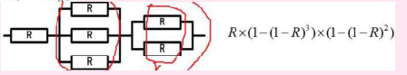

## 19 信息安全和信息系统安全

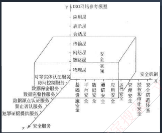

信息安全系统的体系架构

X轴是`安全机制`, 为提供某些安全服务,利用各种安全技能和技巧,所形成的一个较为完善的机构体系

Y轴是`OSI` 网络参考模型

Z轴是`安全服务`, 就是从网络中的各个层次提供给信息应用系统所需要的安全服务支持

由X,Y,Z三个轴形成的信息安全系统三位空间就是信息系统的安全空间

随着网络逐层扩展,这个空间不仅范围逐步加大, 安全的内涵也就更丰富,达到具有认证,权限, 完整加密和不可否认五大要素,也叫做安全空间的五大属性. 

信息安全含义以及属性: 保护信息的保密性、完整性、可用性,另外也包括其他属性,比如: 真实性、可核查性、不可抵赖性和可靠性. 

#### 保密性

信息不被泄露给未授权的个人,实体和国策灰姑娘或不被其使用的特性,包括:

- 最小授权原则
- 防暴漏
- 信息加密
- 物理加密

#### 完整性

信息未经授权不能改变的特性,影响完整性的主要因素由设备故障、人为攻击和计算机病毒等, 保证保证性的方法包括:

- 协议: 通过安全协议检测除被删除、失效、被修改的字段
- 纠错编码方法:利用校验码完成检错和纠错功能
- 密码校验和方法
- 数字签名:能识别除发送方来源
- 公证: 请求系统管理或中介机构证明信息的真实性

#### 可用性

需要时,授权实体可以访问和使用的特性,一般用系统正常使用和整个工作时间之比来度量. 

